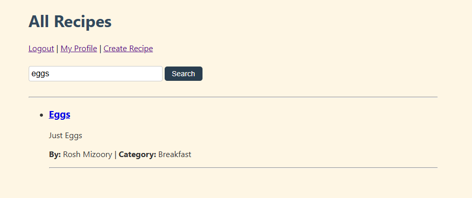
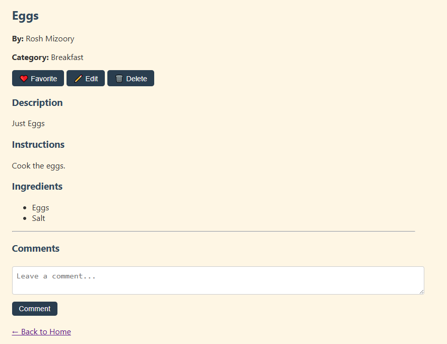
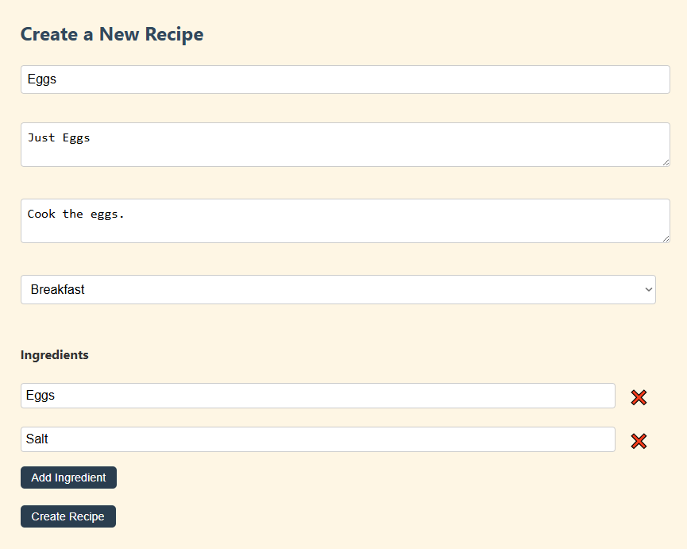
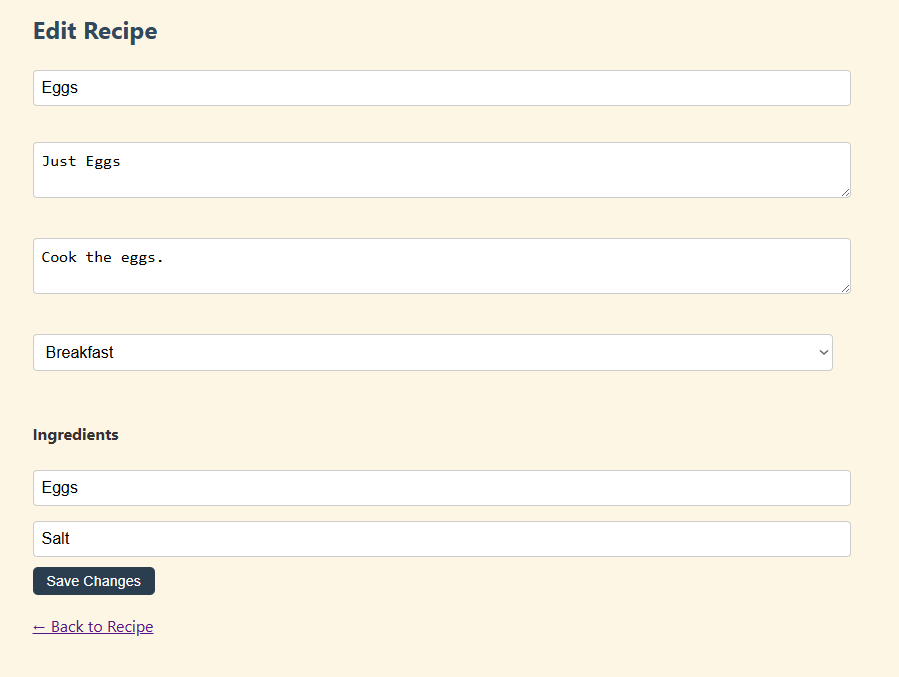
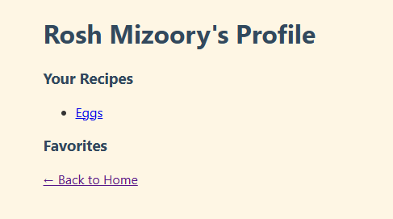

# CS 355 Final Project – Recipe App

## GitHub Repository
[https://github.com/ramizoor/CS-355-Final](https://github.com/ramizoor/CS-355-Final)

## Project Overview
This is a full-stack web application that allows users to register, log in, and manage personal recipes. Users can create, view, edit, delete, favorite, and comment on recipes.

### Technologies Used
- **Node.js** + **Express** for the backend
- **Handlebars** for dynamic page rendering
- **Sequelize** with **SQLite** for the database
- **Express-session** for user authentication
- **CSS** for custom styling
- **Deployed via Render** (coming soon)

---

## Features
- User registration, login, logout
- Session-based authentication with protected routes
- Create, read, update, and delete recipes
- Assign categories and ingredients to recipes
- Favorite and comment on other users' recipes
- Personalized user profile page
- Dynamic ingredient input fields
- Search functionality for recipes
- Mobile-friendly and visually polished UI
- Proper line-break formatting in instructions and descriptions

---

## Screenshots

### Homepage  
Displays all recipes and includes a search bar  

### Recipe Detail Page  
Shows title, category, description, ingredients, and comments  

### Create Recipe  
Form with category selector and dynamic ingredient inputs  

### Edit Recipe  
Same as create, pre-filled with existing data  

### Profile Page  
Lists user's own recipes and saved favorites  

---

## Final Notes
All functionality for the MVP has been completed. The project is tested, styled, and fully operational. It is ready for final deployment and grading.

